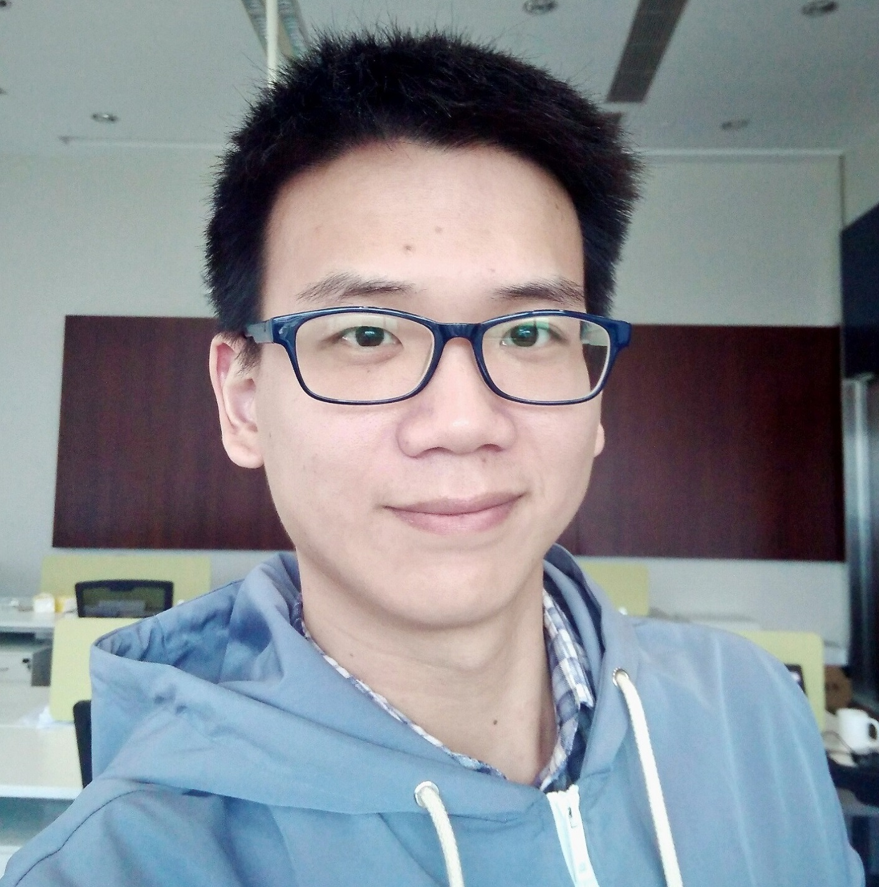

# [{{ site.title }}]({{ site.url }})

Welcome to Linsheng's personal site. Here is my [CV (2020)]({{ site.url }}/res/cv/cv2020.pdf)

## Biography

I am currently a PhD student of National University of Singapore Institute of Operations Research and Analytics (IORA).

I graduated from Peking University School of Economics in 2017 and got a Master's degree from Peking University HSBC Business School in 2020.

## Research Interests

My research interest is broad, including stochastic modeling, optimization theory and algorithms.

## Contact

- Email: linsheng.z@u.nus.edu

## Hobbies

- Occasionally I write [blogs]({{ site.url }}/res/blogs.html) as a record of my study.
- Recently I learned to write poems to get some relax.

 
